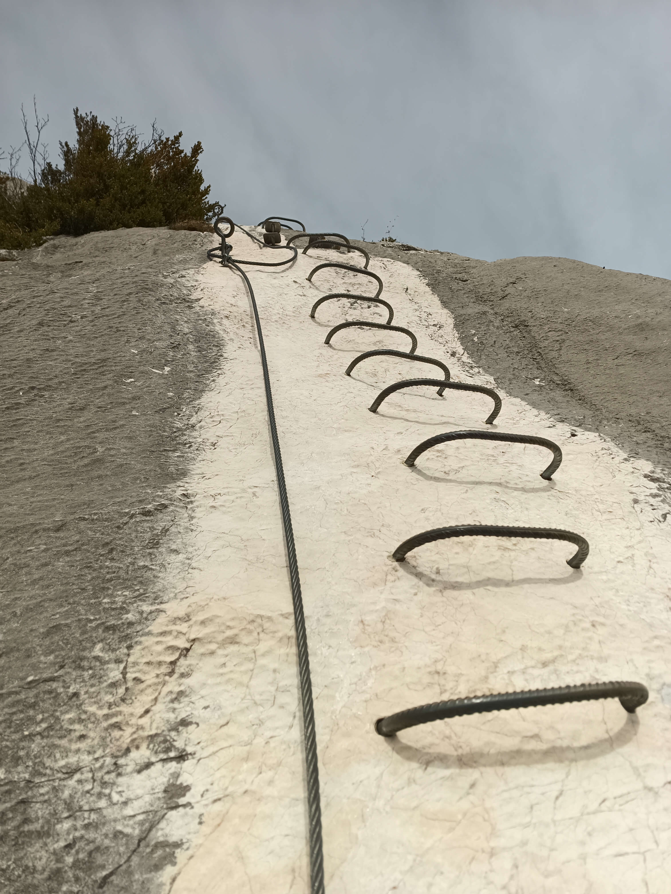

Title:       Biking and Via Ferrata Roche Veyrand
Date:        2024-04-06 10:20
Modified:    2024-04-06 19:30
Tags:        Via Ferrata, Mountain Biking
Category:    Daily Adventures
Slug:        vtt-ferrata-roche-veyrand
Author:      Walter Dal'Maz Silva
Summary:     VTT and Via Ferrata
Lang:        en
Translation: false
Status:      published

A few weeks back I randomly wrote to my club's Whatsapp group to propose a quite unusual mountain activity (at least to the majority point of view): leave in mountain biking, take a break to follow a via ferrata, and then get back on the road. I really don't get it why people sometimes wanna be *monosport*... there is so much you can do by maximizing the possibilities over a day of adventure. As usual, the key point of the trip is that we were not using any personal vehicles; the goal was to use only public transportation to reach the Chartreuse massif and back. 

I was lucky and got a few answers and finally we organized everything to leave early the next morning. This sort of trip needs to be tough of as a last minute deal because weather may change and doing the mix biking-ferrata can easily become impossible. You cannot simply engage in a ferrata without the certainty of a sunny day or no thunderstorms approaching.

---

### Summary

The following table provides the main numbers you need to know before deciding it is worth reading the remaing part of this article. Notice that in *Walking climb* the via ferrata is included. For the minimum set of gear, you can find more [here]({filename}pages/Gear.md).

<table>
<tr><td>Moving time                 </td><td>7 h</td></tr>
<tr><td>Cycling climb               </td><td>1200 m</td></tr>
<tr><td>Walking climb               </td><td>600 m</td></tr>
<tr><td>Cycling technical difficulty</td><td>T1-T2</td></tr>
<tr><td>Cycling exposition level    </td><td>E1</td></tr>
</table>

---

### How did it go?

We took one of the first trains in the morning from Lyon to Chambéry, where our adventure started.

<figure align="center">

<figcaption></figcaption>
</figure>

<figure align="center">

<figcaption></figcaption>
</figure>

<figure align="center">

<figcaption></figcaption>
</figure>

<figure align="center">

<figcaption></figcaption>
</figure>

<figure align="center">

<figcaption></figcaption>
</figure>

<figure align="center">

<figcaption></figcaption>
</figure>

---

## Our track

<figure align="center">
    <iframe 
        src   = "media/2024-04-06-Chartreuse-Roche-Veyrand"
        width = "90%"
        height= "300px"
        title = "Adventure Track"
        >
    </iframe>
    <figcaption>
    Click <a href="media/2024-04-06-Chartreuse-Roche-Veyrand" target="_blank">here</a> to see the full map in a new tab or download the GPX <a href="media/2024-04-06-Chartreuse-Roche-Veyrand/track.gpx" target="_blank">track</a>.
    </figcaption>
</figure>

For the full details and get a higher resolution GPX, you can also check my [Strava activity](https://www.strava.com/activities/11121224316).
