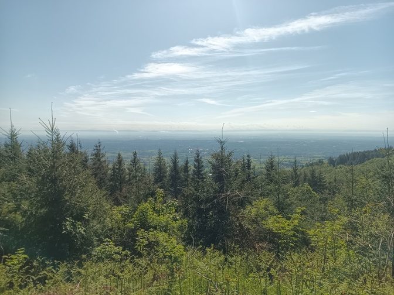
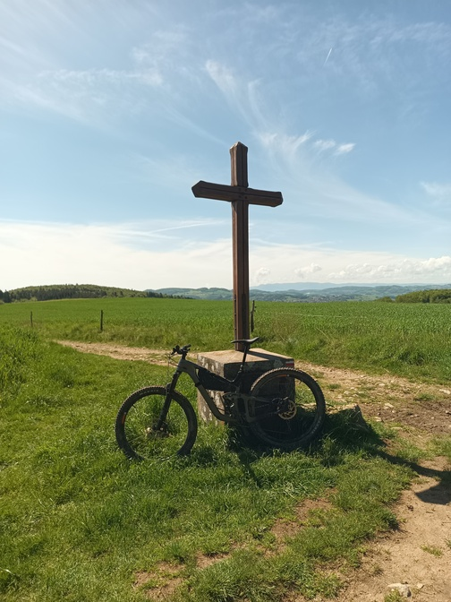

Title:       Circuit 27 modifié pour la mobilité douce
Date:        2024-05-20 18:00
Modified:    2024-05-20 18:00
Tags:        VTT, mobilité douce
Category:    Daily Adventures
Slug:        circuit-27-modifie-vtt
Author:      Walter Dal'Maz Silva
Summary:     VTT et mobilité douce
Lang:        fr
Translation: false
Status:      published

Ce matin je suis parti de la gare de Lyon Saint-Paul pour une balade dans les Monts du Lyonnais. J'ai suivi partiellement le circuit 27 de la FFC, lequel est décrit en détails [ici](https://www.val-vtt.fr/uploads/ZoneActivite/id34/fiche%20circuit%2027.pdf). Pour plus de balades dans le coin, n'hésitez pas à consulter la page [sites FFC - Vallon du Lyonnais](https://sitesvtt.ffc.fr/sites/vallon-du-lyonnais-2/?cn-reloaded=1).

Le choix de faire la première partie en train a été en raison de que rouler entre Lyon et les monts n'est pas très sympa; ça m'aurait couté 20 km en plus pour arriver déjà fatigué au terrain de jeu. Pour le retour je ne voulais pas faire la boucle complète du circuit 27 car à mon avis la partie intéressante c'est les crêtes jusqu'à Yzeron.

Voici quelques chiffres de la sortie

<table>
<tr><td>Approche en train   </td><td>20 mn</td></tr>
<tr><td>Temps en route      </td><td>5 h</td></tr>
<tr><td>Distance totale     </td><td>66 km</td></tr>
<tr><td>Dénivelé positif    </td><td>1600 m</td></tr>
<tr><td>Difficulté technique</td><td>T1-T2</td></tr>
<tr><td>Niveau d'exposition </td><td>E1</td></tr>
</table>

...et la trace GPX correspondante

<figure align="center" style="padding: 15px;">
    <iframe 
        src   = "media/2024-05-20-VTT-Monts-du-Lyonnais"
        width = "90%"
        height= "300px"
        title = "Adventure Track"
        >
    </iframe>
    <figcaption>
    Cliquez <a href="media/2024-05-20-VTT-Monts-du-Lyonnais" target="_blank">ici</a> pour ouvrir la carte dans un nouveau onglet ou téléchargez la <a href="media/2024-05-20-VTT-Monts-du-Lyonnais/track.gpx" target="_blank">trace GPX</a>.
    </figcaption>
</figure>

Pour plus de détails, la sortie est aussi disponible sur [Strava](https://www.strava.com/activities/11454548964).

<figure align="center" style="padding: 15px;">

<figcaption style="padding: 10px;">Une belle vue sur Lyon et la centrale nucléaire du Bugey.</figcaption>
</figure>

<figure align="center" style="padding: 15px;">

<figcaption style="padding: 10px;">La machine du jour (à laver encore)!</figcaption>
</figure>
